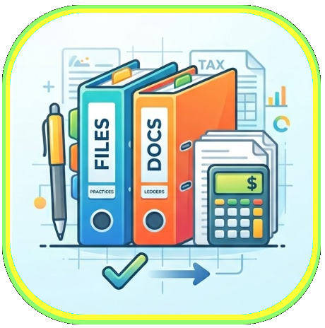
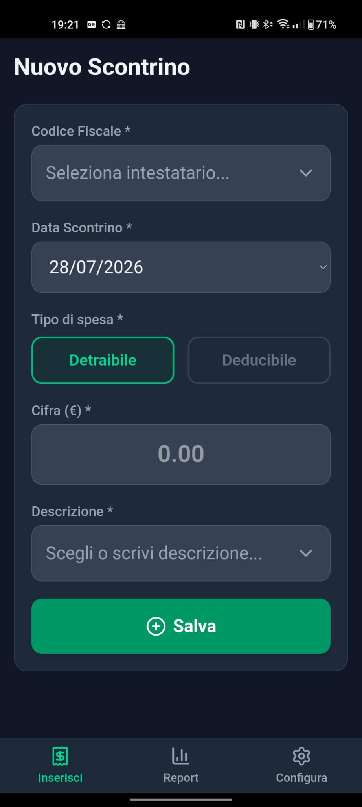
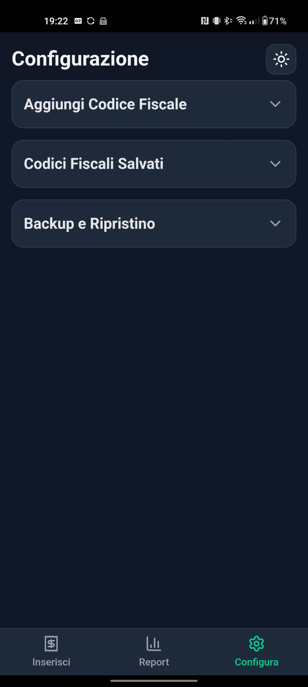
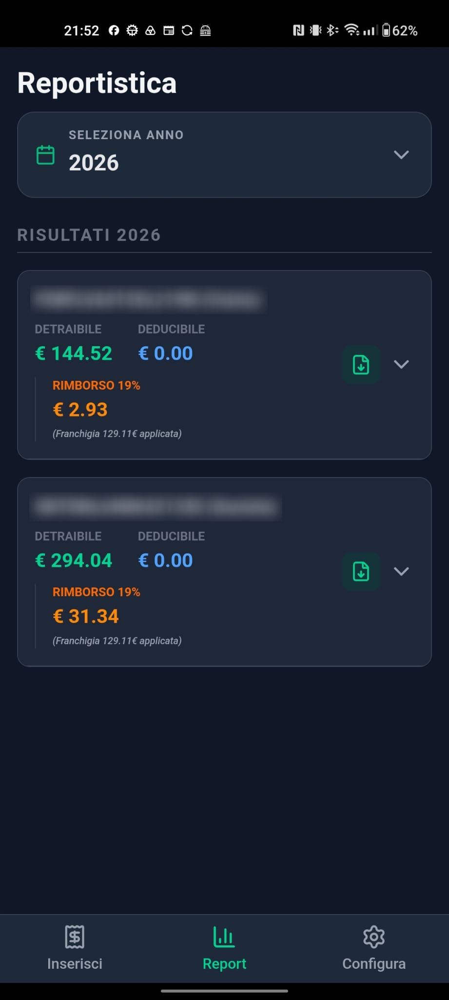

# Spese 730

  

**Spese 730** è un'applicazione Android professionale progettata per semplificare la gestione delle spese detraibili e deducibili ai fini della dichiarazione dei redditi (Modello 730 o Unico). L'app permette di digitalizzare e registrare scontrini e fatture nel momento esatto in cui vengono ricevuti, eliminando il rischio di smarrimento e fornendo un controllo immediato sui potenziali rimborsi fiscali.

---

## 📱 Funzionalità Principali

- **👨‍👩‍👧‍👦 Gestione Multi-Profilo**: Gestisci i Codici Fiscali di tutti i membri della famiglia o di chiunque desideri in un'unica interfaccia centralizzata.
- **📅 Archivio Storico**: Organizzazione automatica dei documenti fiscali suddivisi per anno, facilitando la consultazione e il recupero dei dati.
- **⚖️ Calcolo Intelligente del Rimborso**: L'app integra la logica fiscale italiana, applicando automaticamente la franchigia di legge (129,11€) e calcolando il rimborso IRPEF del 19% sulla rimanenza.
- **📂 Distinzione Fiscale**: Supporto nativo per la divisione tra spese detraibili e deducibili, garantendo una reportistica accurata.
- **📄 Export Report PDF**: Genera e scarica report professionali in formato PDF per ogni Codice Fiscale, pronti per essere consegnati al commercialista o al CAF.
- **💾 Backup Cloud Personale**: I dati risiedono sul tuo telefono, ma puoi eseguire il backup e il ripristino in totale sicurezza utilizzando il tuo account Google Drive.

## ✨ Perché scegliere Spese 730?

A differenza della gestione cartacea tradizionale, **Spese 730** ti permette di avere sempre sotto mano il totale delle spese sostenute e di sapere in anticipo quanto recupererai nella prossima dichiarazione dei redditi, evitando sorprese e ottimizzando i tempi.

## 🔒 Privacy e Sicurezza

La tua riservatezza è la nostra priorità:
- **Dati Locali**: Tutte le informazioni inserite e le scansioni rimangono salvate esclusivamente sul tuo dispositivo.
- **Nessun Server Esterno**: Non utilizziamo database in cloud proprietari; i tuoi dati non lasciano mai il tuo controllo.
- **Integrazione Google Drive**: Il backup avviene direttamente sul tuo spazio Drive personale, protetto dalle credenziali del tuo account Google.

## 📸 Anteprima dell'Interfaccia

  
  
  

## 🚀 Come Iniziare

1. **Scarica l'APK**: Ottieni l'ultima versione disponibile dalla galleria del portfolio.
2. **Abilita Installazione**: Assicurati di aver autorizzato l'installazione da "Origini Sconosciute" nelle impostazioni del tuo smartphone.
3. **Configura i Profili**: Inserisci i Codici Fiscali e inizia subito a registrare le tue prime spese!

---

> [!NOTE]
> *Questo progetto è parte di un portfolio di applicazioni Android open source focalizzate sull'utilità quotidiana e sulla massima trasparenza verso l'utente.*

---
*Ultimo aggiornamento: Luglio 2026*
